# T1_Pemvis

# Biodata
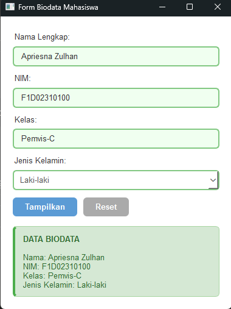

# Konversi Suhu
1. 0°C
   - Fahrenheit
   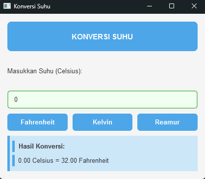
   - Kelvin
   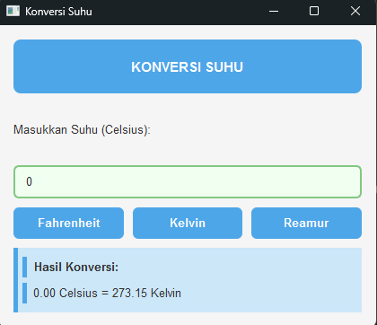
   - Reamur
   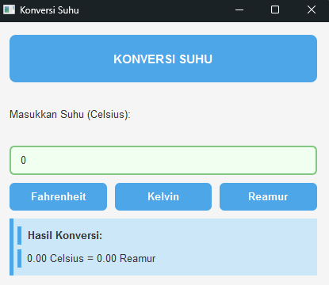

2. 100°C
   - Fahrenheit
   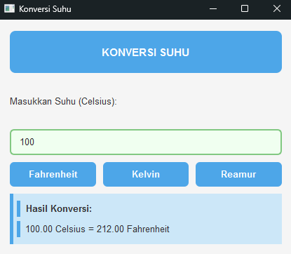
   - Kelvin
   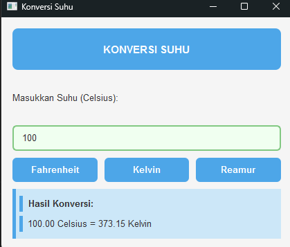
   - Reamur
   
   
3. 37.5°C
   - Fahrenheit
   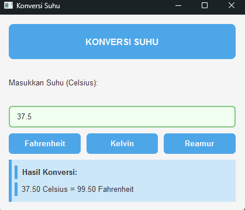
   - Kelvin
   
   - Reamur
   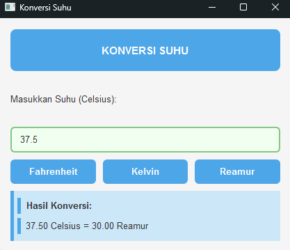

4. -40°C
   - Fahrenheit
   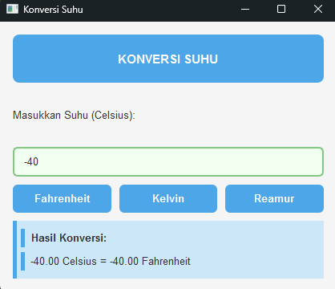
   - Kelvin
   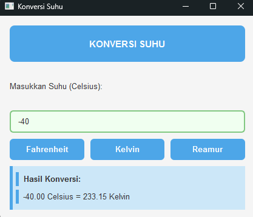
   - Reamur
   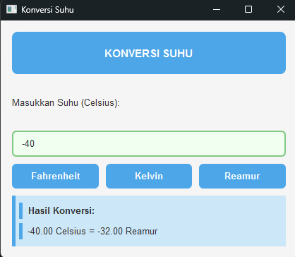
